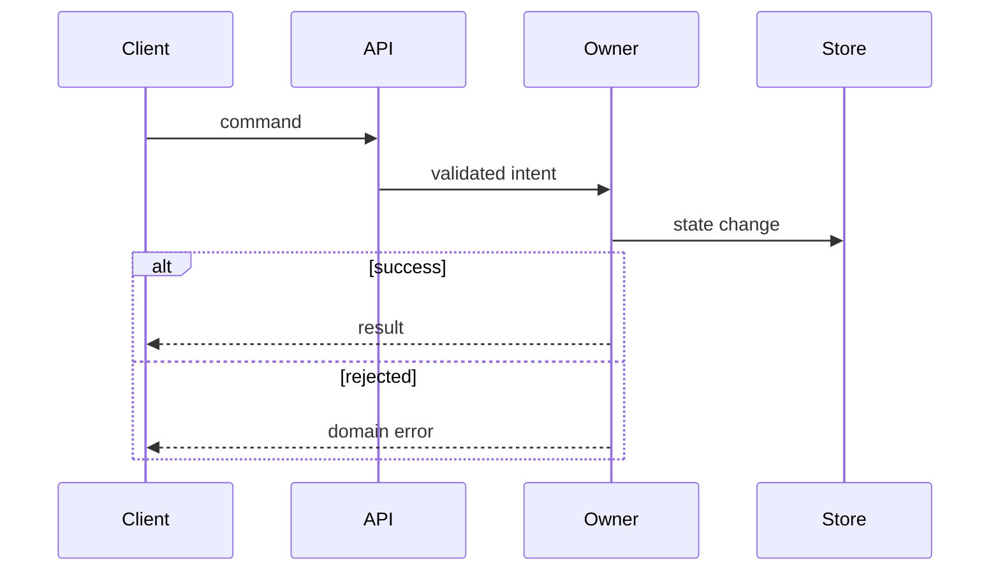

# System Architecture

Decide which parts of the system participate, what each part owns, and how they may interact. Stay at component, boundary, contract, and logical-data level; defer concrete functions, files, and internal types to program design.

## Recover the current architecture

Investigate every system surface implicated by the approved behavior:

- Components, services, responsibilities, and allowed dependencies
- Data ownership, persistence, caches, and sources of truth
- Endpoints, commands, events, queues, jobs, and external systems
- Existing success, failure, retry, and asynchronous flows
- Authorization and security boundaries
- Consistency, transaction, concurrency, ordering, and idempotency guarantees
- Operational constraints, observability, rollout, and compatibility
- Cross-repository dependencies
- Tests and documents that express current contracts

Synthesize one current-state model. Reconcile conflicting terminology, code, tests, and documentation; preserve uncertainty when evidence does not settle it.

Use small component diagrams, contract sketches, and logical data models when they make ownership or boundaries easier to verify. A diagram supports agreement but does not substitute for explicit semantics.

**Current-state criterion:** every implicated component, boundary, source of truth, side effect, and material guarantee is evidenced or explicitly unknown.

## Trace interactions with sequence diagrams

Create current and proposed sequence diagrams whenever behavior crosses component or system boundaries, or when ordering, asynchronous delivery, retries, concurrency, timeouts, or partial failure matters. Omit them only for a genuinely local interaction and record why they add no information.

Show:

- Actors, components, stores, queues, jobs, and external systems
- Semantic messages and the contract data crossing each boundary
- Synchronous versus asynchronous interactions
- State changes and transaction boundaries
- Success responses and material error translations
- Alternate, retry, timeout, cancellation, and partial-success paths
- Parallel work, ordering constraints, and idempotency points

Use separate diagrams for materially different flows when one diagram becomes hard to read. Prefer Mermaid `alt`, `opt`, `loop`, and `par` blocks for compact variations:

Keep participants and messages architectural. Do not introduce proposed internal function names here; program design maps these messages onto concrete calls.

## Classify the change

Classify the proposed feature:

- **Fits:** current ownership, boundaries, and contracts support it.
- **Extends:** it deliberately changes a component, contract, data owner, dependency, or system guarantee.
- **Conflicts:** a straightforward implementation would violate an existing architectural rule or guarantee.

Explain the classification with repository evidence.

## Propose the feature architecture

Specify:

- Participating components
- Responsibility and data ownership
- Boundaries and semantic contracts
- Logical data model, transformations, and invariants
- Dependency direction and data flow
- Consistency and transaction boundaries
- Concurrency, ordering, and idempotency semantics
- Failure, retry, timeout, cancellation, and partial-success semantics
- Authorization, validation, trust, and privacy boundaries
- Observability, rollout, migration, and compatibility
- Cross-repository coordination

Map every approved behavior and acceptance criterion to an architectural owner and path.

Compare viable architectures when ownership and constraints do not determine one answer. Present evidence, tradeoffs, reversibility, and a recommendation. Record rejected alternatives and why they lost.

## Expose architectural pressure

Stop on:

- Unclear or split ownership
- Cyclic or forbidden dependencies
- Duplicated sources of truth
- Contract bypasses
- Cross-boundary transactions
- Incompatible consistency or availability guarantees
- Security boundaries without an enforcing owner
- A small behavior requiring disproportionate component changes

Resolve the pressure with the user, deliberately change the architecture, reduce the requested behavior, or mark the phase blocked. Do not continue merely because an adapter or workaround could make the code compile.

## Present the architecture gate

Update the working artifact with the current-state model, current and proposed sequence diagrams where applicable, proposed architecture, other diagrams or contracts, behavior-to-owner mapping, rejected alternatives, and open risks. Keep concrete method names and file layouts out unless they are existing evidence.

**Complete when:** every approved behavior has an agreed owner and architectural path; every boundary, source of truth, side effect, and system guarantee is explicit; the user has reviewed sequence diagrams for every material cross-boundary or time-ordered flow; all architectural pressure is resolved or blocking; and the user has explicitly approved the architecture.
