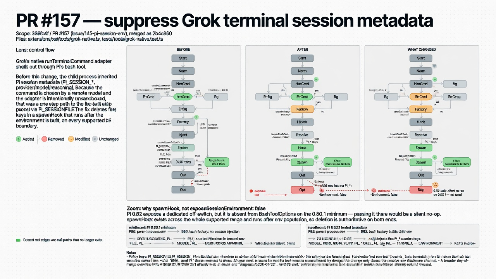

# pi-visualize-code-changes



Pi skill that turns a code change into **before / after / what-changed** Mermaid diagrams — so reviewers see behaviour, not just hunks.

Installable as a [Pi package](https://pi.dev/packages). Works with any Agent Skills harness that loads `SKILL.md`.

## Install (Pi)

```bash
pi install npm:pi-visualize-code-changes

# Recommended: structured lens prompts (ask_user_question)
pi install npm:@juicesharp/rpiv-ask-user-question

# or from git:
# pi install git:github.com/BlockedPath/pi-visualize-code-changes
# or local path while developing:
# pi install /Users/justin/dev/pi-visualize-code-changes
```

Without the ask-user extension the skill still works — it picks the recommended
primary and qualifying second lens itself instead of offering a short
questionnaire when `--lens` is omitted.

Then in a Pi session:

```text
/skill:visualize-code-changes
/skill:visualize-code-changes uncommitted
/skill:visualize-code-changes pr 42 --lens sequence
/skill:visualize-code-changes main...HEAD --lens control-flow --second-lens dependency
/skill:visualize-code-changes main...HEAD --focus src/auth --out docs/diagrams/auth.md
```

## What it produces

One Markdown file (default `docs/diagrams/<slug>.md`) with:

1. **Before** — how the flow worked  
2. **After** — how it works now  
3. **What changed** — merged, colour-coded diff view (added / removed / changed / same)

The primary lens receives all three views. When another lens exposes a distinct,
material, source-backed effect, the artifact can add one **Complementary
perspective** with a focused merged diff. It automatically uses side-by-side
before/after when an overlay would be illegible.

GitHub and GitLab render the Mermaid blocks natively.

## Arguments

```text
[scope] [--lens TYPE] [--second-lens TYPE] [--focus PATH]... [--out PATH] [--slug NAME] [--render]
```

| Token | Meaning |
| --- | --- |
| `scope` | `uncommitted`, `staged`, `pr <n>`, `branch <name>`, `main...HEAD`, `<sha>`, … |
| `--lens` | Primary lens: `control-flow`, `dependency`, `sequence`, `state`, `data-flow`, or `structure` |
| `--second-lens` | Optional complementary lens. Requires `--lens` and must differ from it |
| `--focus` | Limit deep-read/diagram to path(s) |
| `--out` / `--slug` | Output path control |
| `--render` | Also emit SVGs (needs mermaid-cli) |

## Requirements

No npm runtime dependencies — this package is a skill (Markdown + one stdlib Python script).

| Need | Required? |
| --- | --- |
| Pi (or another Agent Skills host) | Yes |
| Git | Typical — diff discovery (`git diff`, `git show`, ranges). Session-edited files still work without it |
| [`@juicesharp/rpiv-ask-user-question`](https://www.npmjs.com/package/@juicesharp/rpiv-ask-user-question) (or any host tool that exposes `ask_user_question` / `AskUserQuestion`) | **Recommended** — interactive primary-only or primary-plus-second choice when `--lens` is omitted. Without it, the skill auto-picks |
| Python 3 | For diagram validation only (stdlib; no pip deps) |
| [`gh`](https://cli.github.com/) (GitHub CLI) | Only for `pr <n>` scope (`gh pr diff`). Other scopes use git alone |
| [`@mermaid-js/mermaid-cli`](https://github.com/mermaid-js/mermaid-cli) (`mmdc`) + Chrome/Chromium | **Optional** — authoritative validation and `--render` SVGs. Without it, validation falls back to built-in heuristics |

```bash
# recommended — lens questionnaire
pi install npm:@juicesharp/rpiv-ask-user-question

# optional — PR scope
# brew install gh   # or see https://cli.github.com/

# optional but recommended — stronger Mermaid validation / SVG render
npm i -g @mermaid-js/mermaid-cli
# mmdc needs a Chrome/Chromium on PATH (or Puppeteer's bundled browser)
```

## Package layout

```text
pi-visualize-code-changes/
├── package.json          # pi.skills → ./skills
└── skills/
    └── visualize-code-changes/
        ├── SKILL.md
        ├── assets/template.md
        ├── references/
        └── scripts/validate_mermaid.py
```

## Development

```bash
# try without publishing
pi install /absolute/path/to/pi-visualize-code-changes
# or one-shot
pi -e /absolute/path/to/pi-visualize-code-changes
```

## Contributing

See [CONTRIBUTING.md](CONTRIBUTING.md). Please follow the
[Code of Conduct](CODE_OF_CONDUCT.md).

Bug reports and feature requests use the GitHub issue templates.

## License

MIT
