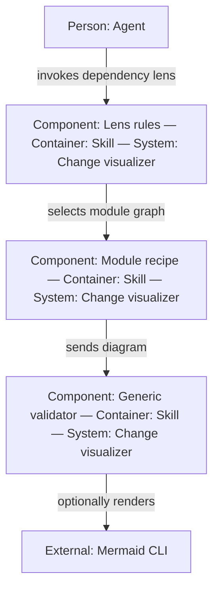
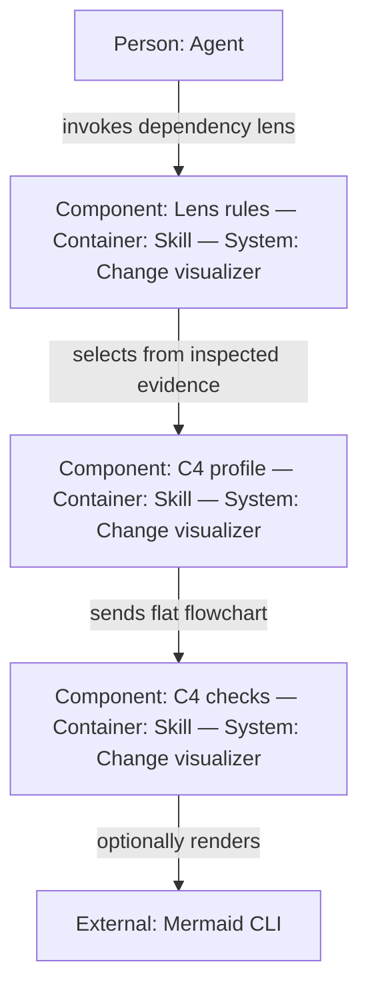
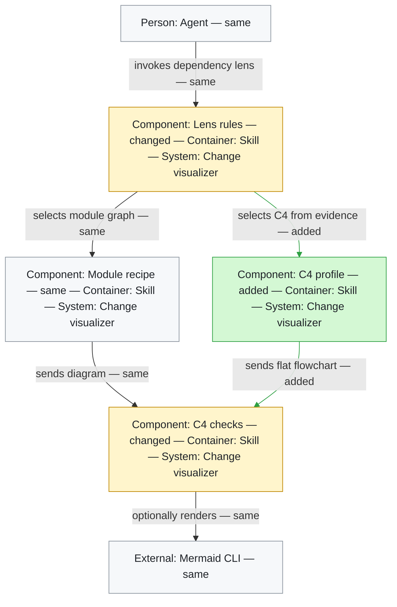

# C4 dependency profile — before & after

**Scope:** `local skill customization`
**Files:** `skills/visualize-code-changes/SKILL.md`, `references/diagram-types.md`, `references/syntax-pitfalls.md`, `scripts/validate_mermaid.py`

This change keeps `dependency` as the public lens while allowing it to choose a
C4-style representation when inspected code proves an architectural boundary.
It also gives the validator terminal-safe profile checks, so generated diagrams
remain truthful in GitHub Mermaid, monochrome output, and terminal renderers.

## Before

The dependency lens always led to a generic module graph; the validator accepted
native Mermaid C4 and had no portable-profile checks.

## After

The same lens selects a Context, Container, or Component representation only
from source evidence, then validates the flat flowchart profile.

## What changed

**Legend** — added, removed, changed, and same are written into the labels as
well as styled, so the diagram does not rely on colour.

## Notes

| Claim | Source evidence |
|---|---|
| The agent invokes the dependency lens | `SKILL.md` frontmatter and step 3 |
| Lens rules select the representation | `SKILL.md` step 3 (`Choose lens and altitude`) |
| The generic module recipe remains available | `references/diagram-types.md` (`Module & dependency graphs`) |
| Context/Container/Component selection is evidence-gated | `references/diagram-types.md` (`C4-style dependency views`) |
| C4 diagrams flow from profile guidance into validation | `SKILL.md` steps 4–5 and `scripts/validate_mermaid.py:lint_block` |
| Mermaid CLI remains an optional external renderer | `scripts/validate_mermaid.py:find_mmdc` and `render_block` |

- A Component view is warranted because this change coordinates three runtime
  responsibilities inside one installable skill package: lens selection,
  diagram authoring guidance, and validation.
- No new `--lens` value or renderer dependency is introduced.
