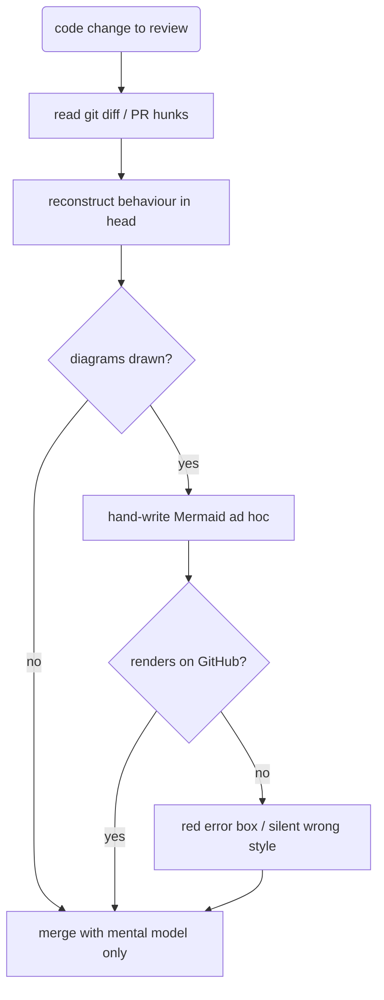
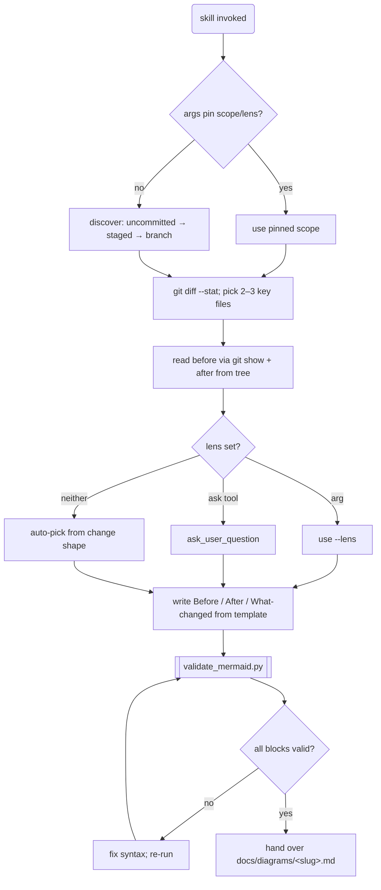
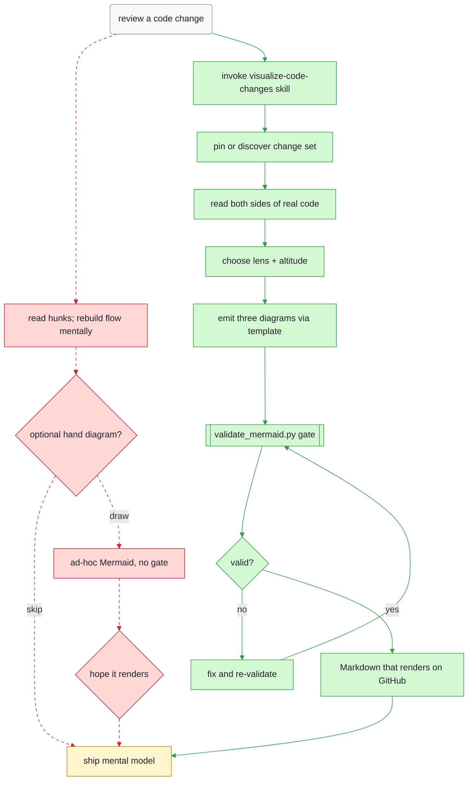
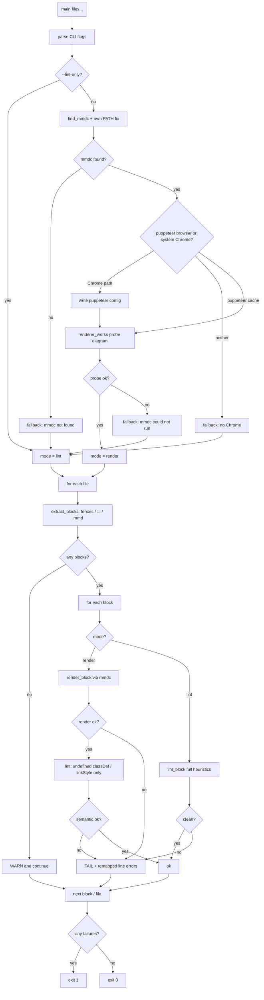

# Initial release — before & after

**Scope:** `95a8da6` (Initial release: pi skill for Mermaid before/after/diff diagrams)  
**Files:** `skills/visualize-code-changes/SKILL.md`, `scripts/validate_mermaid.py`, `assets/template.md`, `references/*`

This commit introduces a Pi skill that turns a code change into three Mermaid diagrams — before, after, and a colour-coded merged diff — so reviewers see behavioural structure instead of reconstructing it from hunks. There is no prior implementation: the “before” path is the ad-hoc review process the package replaces; the “after” path is the agent workflow plus the new `validate_mermaid.py` gate.

| File | What happened | Review effort |
| --- | --- | --- |
| `SKILL.md` | added — full agent workflow | all of it |
| `scripts/validate_mermaid.py` | added — only executable code | all of it |
| `assets/template.md` | added — output skeleton | skim |
| `references/diagram-types.md` | added — lens recipes | skim |
| `references/syntax-pitfalls.md` | added — Mermaid gotchas | skim |
| packaging (`package.json`, README, LICENSE, ignores) | added — publish plumbing | none for behaviour |

## Before

Understanding a change meant reading the diff and rebuilding control flow in your head. Diagrams, if anyone drew them, were optional and unvalidated.

## After

A structured agent skill discovers the change set, reads both sides of the code, picks a lens, writes three diagrams from a template, and refuses to hand off until validation passes.

## What changed

**Legend** — 🟩 added · 🟥 removed · 🟨 modified · ⬜ unchanged.  
Dotted red edges are call paths that no longer exist.

## Zoom: `validate_mermaid.py` driver

The skill’s only executable surface. Mode selection prefers a real `mmdc` render, but never confuses infrastructure failure with a bad diagram.

### Heuristic lint checks (when `mode = lint`, or semantic pass after render)

| # | Check | Why it exists |
| --- | --- | --- |
| 1 | Known diagram header | empty/garbage blocks |
| 2 | Balanced `subgraph` / `end` | structural parse breaks |
| 3 | Unquoted risky chars in labels | #1 real-world Mermaid break |
| 4 | `:::class` → defined `classDef` | silent colour loss |
| 5 | `linkStyle` index &lt; edge count | silent wrong edge colour |
| 6 | bare `end` node id | reserved-word trap |

## Notes

- **Greenfield:** every package file is newly added. The Before diagram is the prior human/agent review process, not a deleted codebase — there was nothing to `git show` before `95a8da6`.
- Packaging files (`package.json`, LICENSE, ignores) are omitted from the flow; they do not affect runtime behaviour beyond Pi discovering `./skills`.
- Follow-up commits after this SHA only touch docs/preview (ask-user recommendation, requirements table, gallery image) and are out of scope here.
- Edge colours in “What changed”: removed paths are indices 0,2–6; added paths are 1 and 7–16.
