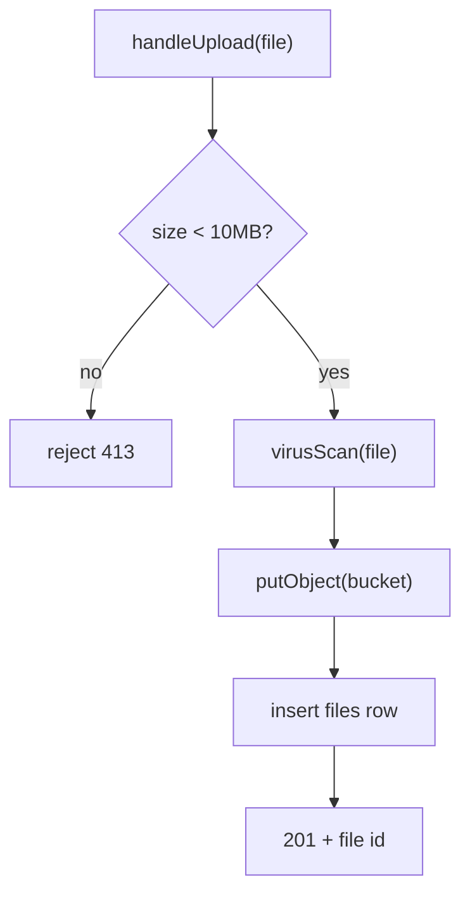
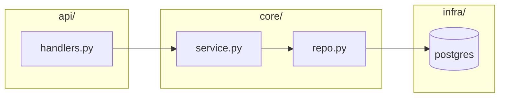
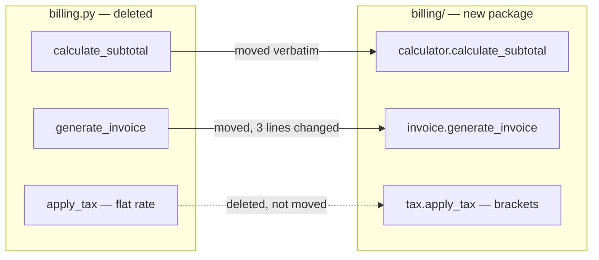
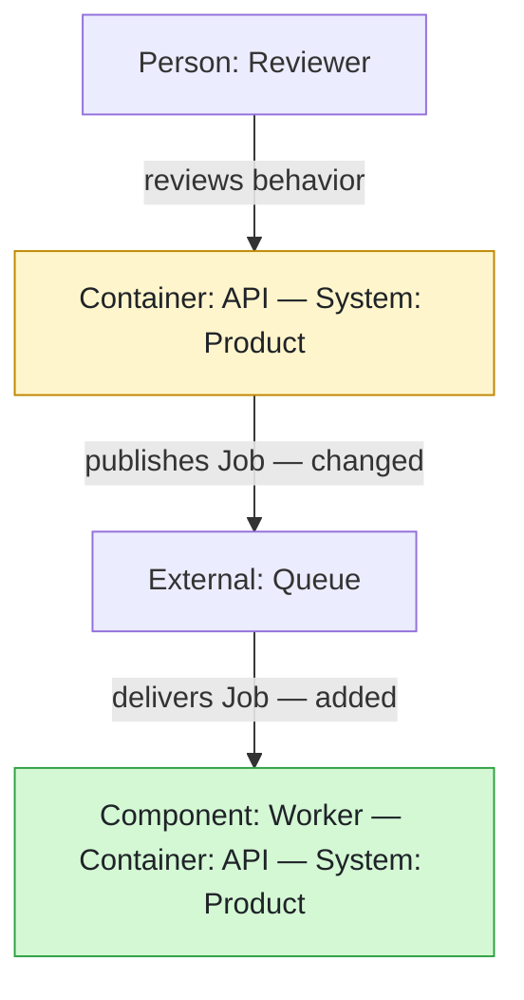
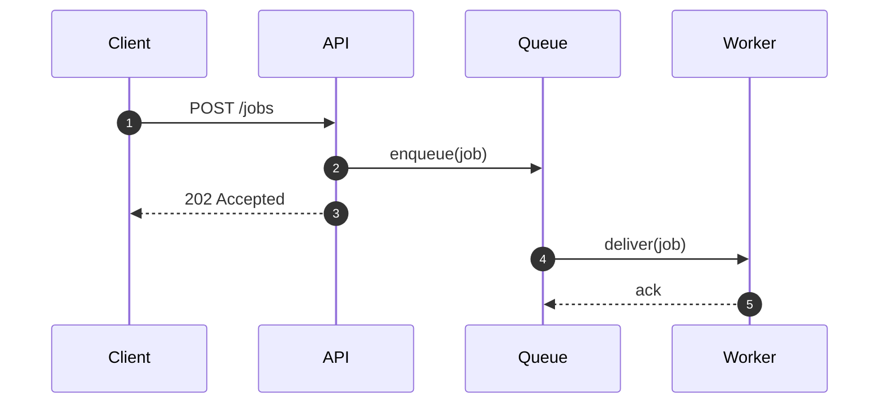
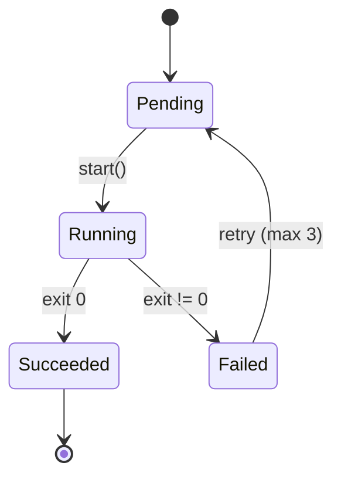
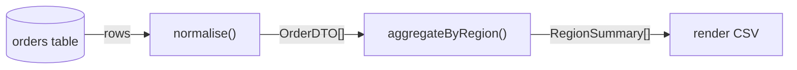
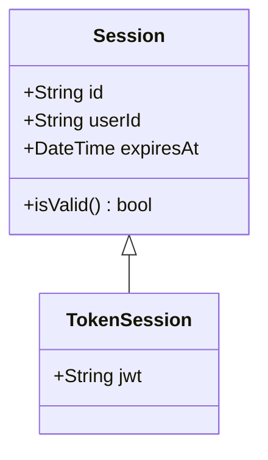
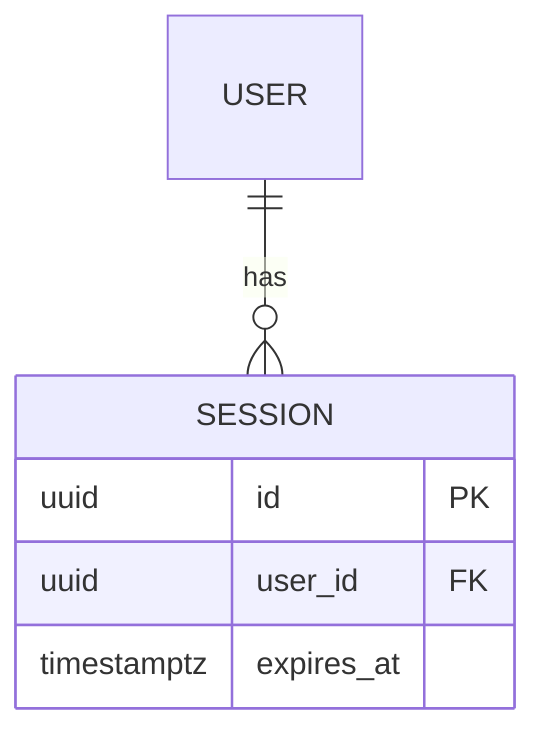
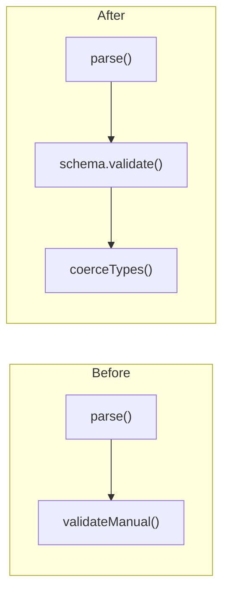

# Choosing and writing the right diagram

Read this when the change needs anything beyond a basic `flowchart TD`. Each
section gives the selection rationale, a working skeleton, and how to express
before/after/diff in that diagram type — the diff view is the awkward part for
non-flowchart types, and the answers differ.

## Contents

1. [Control flow — flowchart](#control-flow--flowchart)
2. [Module & dependency graphs](#module--dependency-graphs)
3. [C4-style dependency views](#c4-style-dependency-views)
4. [Sequence diagrams](#sequence-diagrams)
5. [State machines](#state-machines)
6. [Data flow](#data-flow)
7. [Class & schema diagrams](#class--schema-diagrams)
8. [Complementary perspectives](#complementary-perspectives)
9. [When the merged diff view stops working](#when-the-merged-diff-view-stops-working)

---

## Control flow — flowchart

The default, and right for most logic changes. `TD` (top-down) suits branching and
error paths; `LR` suits pipelines.



Shape conventions readers already know, worth keeping consistent:

| Shape | Syntax | Means |
|---|---|---|
| Rectangle | `A["doThing()"]` | a step |
| Diamond | `B{"ok?"}` | a decision |
| Rounded | `C("entry point")` | start/end |
| Cylinder | `D[("sessions")]` | datastore |
| Subroutine | `E[["renderPage()"]]` | call into another documented flow |

Label decision edges with the condition (`-->|yes|`). An unlabelled branch forces
the reader back into the source, which defeats the purpose.

**Diff view:** merged graph, `:::added` / `:::removed` / `:::changed` / `:::same`
per node, dotted red edges for dead paths. This is the case the SKILL.md example
covers.

---

## Module & dependency graphs

For changes that move code rather than alter logic — extracting a module,
inverting a dependency, introducing a layer. `LR` reads best since dependency is
naturally left-to-right.



Use `subgraph` for the layer/package boundary — the boundary is usually the whole
point of the change. One node per module, not per function; if a module needs
internal detail, that is a second diagram.

**Diff view:** colour the *edges* as much as the nodes. Dependency changes are
edge changes, and a graph that only recolours boxes will look nearly identical
before and after. Show a removed dependency as a dotted red edge that still
appears in the merged view, so the reader sees what was severed.

### The fate map

When a change is mostly relocation — a module split, a package extraction, a
layer being carved out — plain colour coding fails. Every unit is "removed from
here, added over there", so everything lights up and the reader learns nothing
about where to spend attention.

Put the old container on one side and the new ones on the other, then draw one
edge per unit, labelled with what happened to it:



The edge labels are the payload. `moved verbatim` means *skip this file*, which
is often the most valuable sentence in the whole document.

Earn those labels rather than guessing them. Git reports a wholesale file
replacement the same way whether code was relocated untouched or rewritten from
scratch, so compare the actual bodies:

```bash
git show main:billing.py | awk '/^def calculate_subtotal/,/^$/' > /tmp/before.txt
git show HEAD:billing/calculator.py | awk '/^def calculate_subtotal/,/^$/' > /tmp/after.txt
diff /tmp/before.txt /tmp/after.txt && echo "identical -- moved, not rewritten"
```

Pairing the fate map with a small table — file, what happened, review effort —
turns the diagram into something a reviewer can act on immediately.

---

## C4-style dependency views

C4 is a **representation within the dependency lens**, not another `--lens`
value. Use it when inspected source establishes a meaningful boundary:

| View | Use only when evidence shows… | Typical evidence |
|---|---|---|
| Context | An actor/system interaction or external-system boundary changed | routes, public API handlers, auth/trust policy, integration clients |
| Container | A call or data flow changed between deployable units | service entry points, manifests, Dockerfiles, queue/database configuration |
| Component | A runtime/module responsibility changed inside one deployable unit | imports, call sites, module APIs, registration/wiring code |

Directory names are hints, not proof. For every element and relationship, add a
compact evidence table in Notes with a source path and symbol, or a stable line
when no symbol exists. Fall back to the ordinary module graph when evidence does
not support the boundary.

Use a flat ordinary flowchart so the artifact works in GitHub Mermaid and
terminal renderers. Encode ownership in node text instead of subgraphs, keep
labels concise, use exactly one global direction, and label every relationship
by intent, protocol, or data shape:



The exact role prefixes are `Person:`, `System:`, `Container:`, `Component:`,
and `External:`. In change views, use `:::added`, `:::removed`, `:::changed`, and
`:::same` as progressive enhancement, but also put `— added`, `— removed`, or
`— changed` in relationship or element text wherever fate would otherwise be
ambiguous. Meaning must survive monochrome output.

Do not emit native Mermaid C4 forms such as `C4Context`, `C4Container`,
`C4Component`, `C4Dynamic`, or `C4Deployment`. Do not use subgraphs as C4
boundaries: some terminal renderers attach cross-boundary relationships to the
frame instead of the named endpoint. Ordinary dependency graphs and fate maps
may still use subgraphs.

---

## Sequence diagrams

Right when ordering, round trips, or who-initiates-what is the substance —
auth handshakes, retries, webhook flows, anything touching multiple services.
A flowchart cannot express "then B replies to A" without lying about time.



`autonumber` earns its place — it gives the reader stable numbers to refer to.
Declare participants explicitly to control column order. Use `-->>` for replies
and `-)` for fire-and-forget.

Structural blocks, each closed by `end`:

```
alt token expired
    A-->>C: 401
else valid
    A-->>C: 200
end

loop every 30s
    W->>A: heartbeat
end

opt if cache miss
    A->>DB: query
end
```

**Diff view:** sequence diagrams have no `classDef`, so the flowchart colouring
approach does not transfer. Two options that do work:

- `rect rgb(212,248,212)` blocks wrapping added exchanges, `rgb(255,215,213)` for
  removed ones — the closest thing to the standard colour coding:

  ```
  rect rgb(212, 248, 212)
      A->>T: verifyToken(jwt)
  end
  ```

- Annotate message text directly: `A->>B: [ADDED] verifyToken(jwt)` and
  `Note over A,B: removed — checkPassword()`.

The `rect` approach is better when added/removed steps are contiguous; annotation
is better when changes are scattered through a long exchange.

---

## State machines

For lifecycle changes — order status, connection handling, job states, feature
flags. Use it when the change adds or removes a state or a transition, which is
exactly the kind of change a diff obscures badly.



Label transitions with what triggers them. `[*]` marks entry and exit.

**Diff view:** `stateDiagram-v2` does support `classDef` and `:::`, so the normal
colour coding works:

```
Cancelled:::added
%% Copy the complete `added` classDef from assets/template.md.
```

A newly reachable state and a newly *unreachable* one are both easy to miss in a
diff and obvious in this view — call them out in prose too.

---

## Data flow

For changes to how data is shaped and moved: a new transformation step, a changed
schema, a different serialisation boundary. `LR` with the payload shape in the
edge labels:



Putting the type or shape on the edge is what distinguishes this from a control
flow diagram, and it is usually where the change lives — a field added to a DTO
shows up as an edge-label change even when every node is untouched.

---

## Class & schema diagrams

For changes to type structure, inheritance, or database schema.



Relations: `<|--` inheritance, `*--` composition, `o--` aggregation, `-->`
association.

For database work `erDiagram` is usually the better fit:



**Diff view:** neither type supports `classDef` reliably. Mark changed members in
the member text (`+jwt String  << added >>`) or annotate with a `note`. For schema
changes, a small added/removed/changed table beneath the diagram is often clearer
than colour anyway, since column-level detail is what reviewers check.

---

## Complementary perspectives

A second lens is not another full triptych. The primary lens owns Before, After,
and What changed; the complementary perspective contributes one focused change
view after them. Begin with one sentence naming the distinct question it answers:

> Dependency perspective: which package boundaries and imports changed even
> though the request path stayed recognizable?

Use the diff representation defined by the second lens's section above. Keep its
altitude independent from the primary lens: a control-flow primary may use
function-level steps while a dependency complement uses modules and packages.
Do not force node correspondence across lenses.

The second view must reveal a material, source-backed effect that the primary
lens obscures. If it merely restates the same change with different shapes, omit
it. Never add more than one complementary lens.

---

## When the merged diff view stops working

The merged graph is the default because it puts the change in one picture. It
fails when before and after share almost no structure — a genuine rewrite rather
than an edit. Symptoms: more than about half the nodes are `added` or `removed`,
or the graph has two disconnected components that only meet at the entry point.

Also switch when the overlay makes removed and current edges look like one
plausible path, even if the nodes overlap. Diagram size above roughly 15 nodes
after reasonable grouping and a need to mentally hide most red or green elements
are strong supporting signals.

At that point the merged view is just the two diagrams overlaid with extra colour,
and readers do better with an explicit side-by-side:



Choose automatically rather than asking the user to judge a diagram they have
not seen. Say in the prose why you switched — "this was a rewrite rather than an
edit, so a merged view would not be legible" tells the reader something true
about the change itself, which is useful information rather than an apology.
